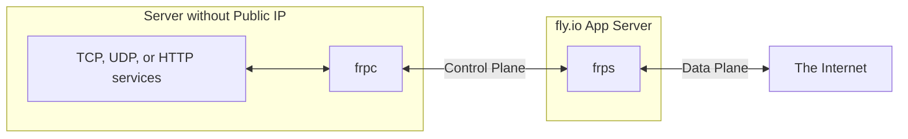
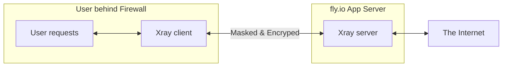
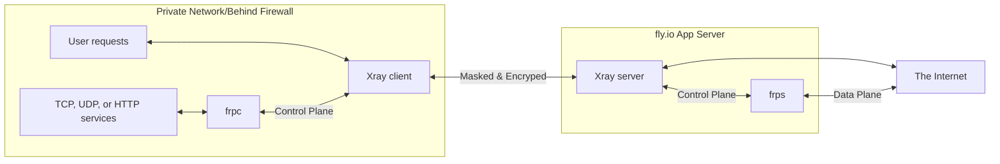

# Xray and FRP on fly.io

This project combines Xray and FRP, allowing you to run your own secure tunnels and proxies on fly.io, bypassing CGNAT limitations and accessing services behind firewalls.  Enjoy ngrok-like functionality with custom TCP/UDP ports, plus the versatility of Xray for various proxying needs, all within a single fly.io application.

> [!NOTE]
> On 2024, fly.io will now charge $2/mo for a dedicated IPv4 address, but everything under $5 bill monthly is waved, so if you have 2 or fewer dedicated IPv4, it is still free.

## Features

* **Combined Xray and FRP:** Leverage both tools for flexible tunneling and proxying.
* **Custom TCP/UDP Ports:**  Choose your desired ports, unlike ngrok's random port assignments for free users.
* **Xray Functionality:**  Proxy traffic using various protocols (vless, vmess, trojan).
* **Easy Deployment:** Deploy with flyctl or directly from GitHub Codespaces.
* **Patched FRP for UDP:**  Modified FRP to bind to `fly-global-services` for reliable UDP support on fly.io.
* **Suspend/Resume:** Easily control resource usage by suspending and resuming your fly.io app.

## Architecture

### Normal frp


### Normal Xray


### Combine Xray & frp

## Deployment

### GitHub Codespaces

1. Fork this repository.
2. Open the forked repository in GitHub Codespaces.
3. Update the `FRP_VERSION` in the `Dockerfile` to the latest FRP release if necessary.
4. Authenticate with flyctl: `fly auth login` or set `FLY_API_TOKEN` in Codespaces secrets.
5. Create a fly.io app: `fly launch --copy-config --name <your-app-name> --no-deploy`.  Answer the prompts to configure the region.
6. Set secrets: `fly secrets set -a <your-app-name> FRP_TOKEN=<your-token> FRP_DASHBOARD_PWD=<your-password> UUID=<your-uuid>`
7. Deploy: `fly deploy -a <your-app-name> --ha=false` and allocate a dedicated IPv4 address when prompted.
8. Configure your client (see below) and connect!

### Local Deployment (flyctl)

1. Install [flyctl](https://github.com/superfly/flyctl).
2. Clone this repository.
3. Update the `FRP_VERSION` in the `Dockerfile` to the latest FRP release if necessary.
4. Authenticate with flyctl: `fly auth login`.
5. Follow steps 5-8 from the GitHub Codespaces instructions.


## Xray Client Configuration

* **Address:** `<your-app-name>.fly.dev`
* **Port:** 443 or 80
* **UUID:** `<your-uuid>`
* **Protocol:** vless, vmess, or trojan
* **Path:** `/vless`, `/vmess`, or `/trojan` (matching the chosen protocol)
* **Transport:** ws
* **ws-host:** `<your-app-name>.fly.dev`
* **TLS:** Enabled (for port 443)
* **SNI:** `<your-app-name>.fly.dev`
* **Allow Insecure:** true
* **Flow:** `<empty>`
* **Encryption:** none
* **Security:** auto


## FRP Client Configuration (frpc.toml)

See the [Example frpc.toml](#example-frpctoml) section below.


## Updating Server Configuration

Modify `frps.toml` and/or `fly.toml` and redeploy: `fly deploy -a <your-app-name>`.


## Managing Your App

* **Suspend:** `fly scale count 0 -a <your-app-name>`
* **Resume:** `fly scale count 1 -a <your-app-name>`


## Example frpc.toml

```toml
serverAddr = "<your-app-name>.fly.dev"
auth.token = "<your-token>"

# For KCP: (Default)
serverPort = 7000
transport.protocol = "kcp"

# For TCP:
# serverPort = 7000
# transport.protocol = "tcp"

# For QUIC:
# serverPort = 7001
# transport.protocol = "quic"

[[proxies]]
name = "SSH"
type = "tcp"
localIP = "127.0.0.1"
localPort = 22
remotePort = 8022

[[proxies]]
name = "Minecraft Java"
type = "tcp"
localIP = "127.0.0.1"
localPort = 25565
remotePort = 25565

[[proxies]]
name = "Minecraft Bedrock"
type = "udp"
localIP = "127.0.0.1"
localPort = 19132
remotePort = 19132

[[proxies]]
name = "Experimental Test (TCP)"
type = "tcp"
localIP = "127.0.0.1"
localPort = 3072
remotePort = 3072

[[proxies]]
name = "Experimental Test (UDP)"
type = "udp"
localIP = "127.0.0.1"
localPort = 3072
remotePort = 3072
```


## HTTP Tunneling

For HTTP tunneling, Cloudflare Tunnel is recommended.  See the [wiki](https://github.com/AnimMouse/frp-flyapp/wiki/HTTP-Tunneling) for HTTP tunneling with FRP on this setup.


## IPv6 Support

IPv6 is partially supported. See the original repository for details and limitations regarding `fly-global-services` and IPv6.  Allocate IPv6 with: `fly ips allocate-v6 -a <your-app-name>`.


## Credits

* [AnimMouse/frp-flyapp](https://github.com/AnimMouse/frp-flyapp/) (Original FRP on fly.io project)
* [thawhakyi/HerokuXray](https://github.com/thawhakyi/HerokuXray/) (Run Xray in Heroku)
* [FarelRA/xray-flyapp](https://github.com/FarelRA/xray-flyapp) (Xray and FRP combined)


## Further Information

* [awesome-tunneling](https://github.com/anderspitman/awesome-tunneling)


## CGNAT and Why This Project Matters

This project helps circumvent the limitations imposed by Carrier-grade NAT (CGNAT), allowing you to expose your services to the internet even when behind a CGNAT.  Read more about the discussion surrounding NAT: [Is NAT a conspiracy?](https://chatgptwith.me/posts/is-nat-a-conspiracy/)
